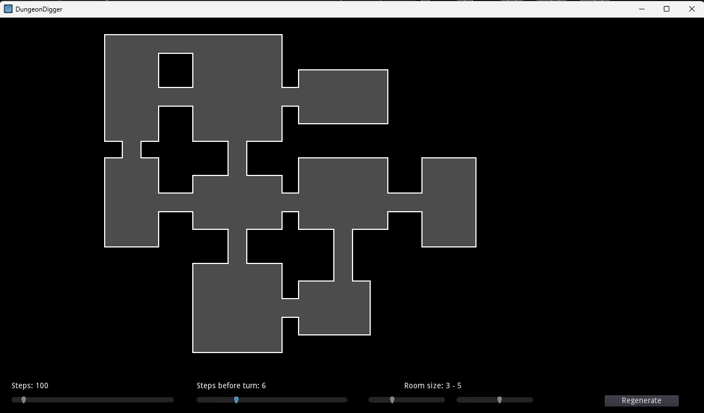

# DungeonDigger

DungeonDigger is a dungeon generation project built in Godot 3.2.1.  
It creates procedural dungeons based on a “walker/digger” algorithm, inspired by the tutorial linked below.

## Tutorial

This project is based on the tutorial by HeartBeast:

- Video: [https://youtu.be/2nk6bJBTtlA](https://youtu.be/2nk6bJBTtlA)
- GitHub: [https://github.com/uheartbeast/walker-level-gen/tree/master](https://github.com/uheartbeast/walker-level-gen/tree/master)

## Features

- Procedural dungeon generation using a digger/walker algorithm.
- Adjustable parameters via the UI:
  - **Number of steps** (`steps_nb`): controls how many steps the digger takes.
  - **Steps before turning**: how many steps the digger takes before changing direction.
  - **Chance to turn**: the % of chance to turn at any step.
  - **Room size**: minimum and maximum size of rooms generated.
- Regenerate the dungeon either by pressing **Enter** or clicking the **Generate Dungeon** button.
- Real-time adjustments with sliders for steps and room size.

### Next steps
- Add random on turn to create cave layout
- Add Pillar in middle of room
- Change the layout size
- Add export to png of the generated dungeon

## How to Run

### Using the executable

- Navigate to the `executable` folder.
- Run `DungeonDigger.exe`.

### Using Godot editor

1. Open the project in Godot 3.2.1.
2. Make sure `World.tscn` is set as the main scene.
3. Click **Play** (F5) to run.
4. Adjust sliders and press **Generate Dungeon** or **Enter** to regenerate.

## Screenshots

